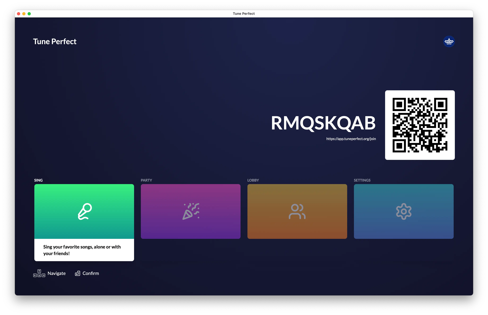
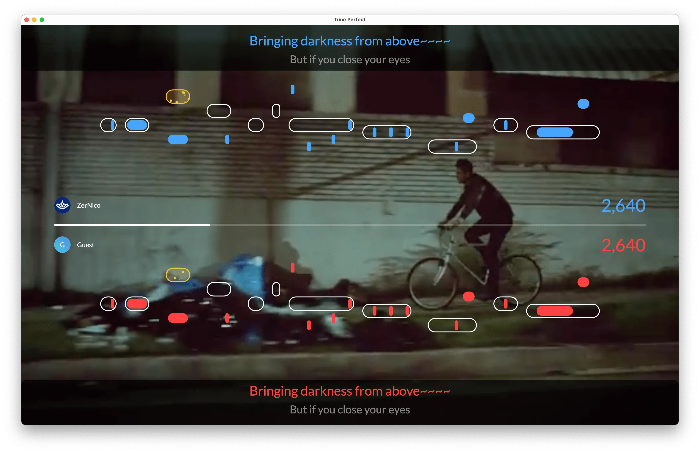
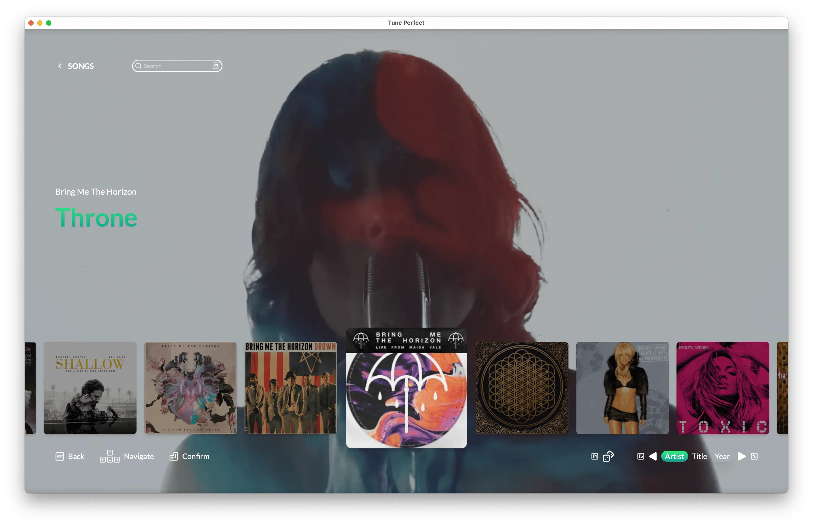

# Tune Perfect

[tuneperfect.org](https://tuneperfect.org/)

A modern karaoke game that brings the party to your living room. Perfect your pitch, compete with friends, and have a blast!

## Features

- 🎤 Real-time pitch detection with instant feedback
- 🎮 Party modes for competitive fun
- 👥 Online accounts and lobbies
- 🎛️ Customizable settings
- 🏆 Score tracking and leaderboards
- 🖥️ Cross-platform support (Windows, macOS, Linux)

## Screenshots





## Download

Download the game from [tuneperfect.org](https://tuneperfect.org).


## Development

### Prerequisites

- [caddy](https://caddyserver.com/docs/install) - For local development routing
- [docker](https://docs.docker.com/get-docker/) - For running development services
- [bun](https://bun.sh/docs/installation) - JavaScript runtime and package manager

### Setup

1. Add the following entries to your `/etc/hosts` file (required for local development):
```bash
127.0.0.1 tuneperfect.localhost api.tuneperfect.localhost app.tuneperfect.localhost
```

2. Install dependencies:
```bash
bun install
```

3. Start development services:
```bash
docker compose -f docker-compose.dev.yml up -d
caddy start
```

4. Start the development server:
```bash
bun run dev
```
To run only specific apps, use the following commands:
```bash
bun run dev --filter @tuneperfect/web --filter @tuneperfect/api # run only web and api
```


## Contributing

Contributions are welcome! Feel free to submit issues and pull requests.

## License

[MIT](LICENSE)